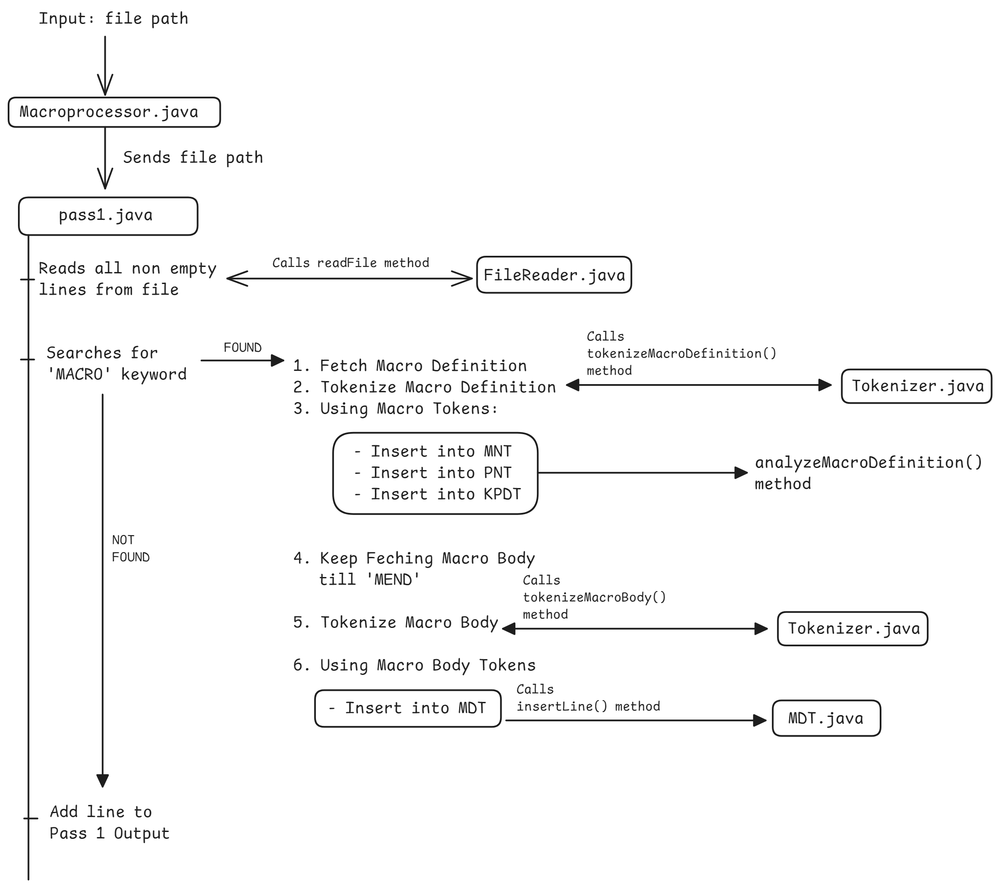

## Assignment 2

### Working Diagram



### Folder Structure

```
Assignment      #CWD
|   src
|   |   Macroprocessor.java     #Entry Point
|   |   pass1
|   |   |   ...     # All files
|   target
|   |   Macroprocessor.class
|   |   pass1
|   |   |   ...     # All compiled classes
|   |   
```

## How to run on Linux

```bash
# if target folder not created
mkdir target 

javac -d target $(find src -name "*.java")
java -cp target Macroprocessor

#Java code runs

rm -r target/*
```

## How to run on Windows
```
mkdir target    # if target does not exists

javac -d target (Get-ChildItem -Recurse -Filter *.java -Path src).FullName
java -cp target src.Macroprocessor  <testcase-file.asm>

# Java code runs

rm -r target/*

```


# Test cases

## Testcase 1

```bash
java -cp target src.Macroprocessor  testcase1.asm
```

## Testcase 1 output

```
--- PASS 1 Completed ---
-- Macro Name Table (MNT) --
name    : pp : kp : MDTP : PNTP : KPDTP
M1      : 2  : 2  : 0    : 0    : 0

-- Parameter Name Table (PNT) --
position : parameter
1 : &X
2 : &Y
3 : &A
4 : &B

-- Keyword Parameter Default Table --
parameter  :  default argument
&B :  __
&A : AREG

-- Macro Definition Table --
MOVER (P,3) (P,1)
ADD (P,3) ='1'
MOVER (P,4) (P,2)
ADD (P,3) ='5'
MEND

PASS 1 Output :
M1 10 20 &B=CREG

-- END OF PASS 1 --
```

## Testcase 2

```bash
java -cp target src.Macroprocessor testcase2.asm
```

## Testcase 2 output

```
--- PASS 1 Completed ---
-- Macro Name Table (MNT) --
name    : pp : kp : MDTP : PNTP : KPDTP
M1      : 2  : 2  : 0    : 0    : 0
M2      : 2  : 2  : 5    : 4    : 2


-- Parameter Name Table (PNT) --
position : parameter
1 : &X
2 : &Y
3 : &A
4 : &B
5 : &X
6 : &Y
7 : &A
8 : &B


-- Keyword Parameter Default Table --
parameter  :  default argument
&B :  __
&A : AREG
&A : CREG
&B : DREG


-- Macro Definition Table --
MOVER (P,3) (P,1)
ADD (P,3) ='1'
MOVER (P,4) (P,2)
ADD (P,3) ='5'
MEND
MOVER (P,7) (P,5)
MOVER (P,8) (P,6)
ADD (P,7) ='15'
ADD (P,8) ='10'
MEND


PASS 1 Output :
M1 10 20 &B=CREG
M2 100 200 &V=AREG &U=BREG


-- END OF PASS 1 --
```

## Testcase 3

```bash
java -cp target src.Macroprocessor testcase3.asm
```

## Testcase 3 output

```
--- PASS 1 Completed ---
-- Macro Name Table (MNT) --
name    : pp : kp : MDTP : PNTP : KPDTP
M1      : 2  : 2  : 0    : 0    : 0
M1      : 3  : 2  : 5    : 4    : 2


-- Parameter Name Table (PNT) --
position : parameter
1 : &X
2 : &Y
3 : &B
4 : &A
5 : &P
6 : &Q
7 : &R
8 : &U
9 : &V


-- Keyword Parameter Default Table --
parameter  :  default argument
&B :  __
&A : AREG
&V : DREG
&U : CREG


-- Macro Definition Table --
MOVER (P,4) (P,1)
ADD (P,4) ='1'
MOVER (P,3) (P,2)
ADD (P,4) ='5'
MEND
MOVER (P,8) (P,5)
MOVER (P,9) (P,6)
ADD (P,8) ='15'
ADD (P,9) ='10'
MEND


PASS 1 Output :
M1 10 20 &B=CREG
M1 100 200 300 &V=AREG &U=BREG


-- END OF PASS 1 --
```