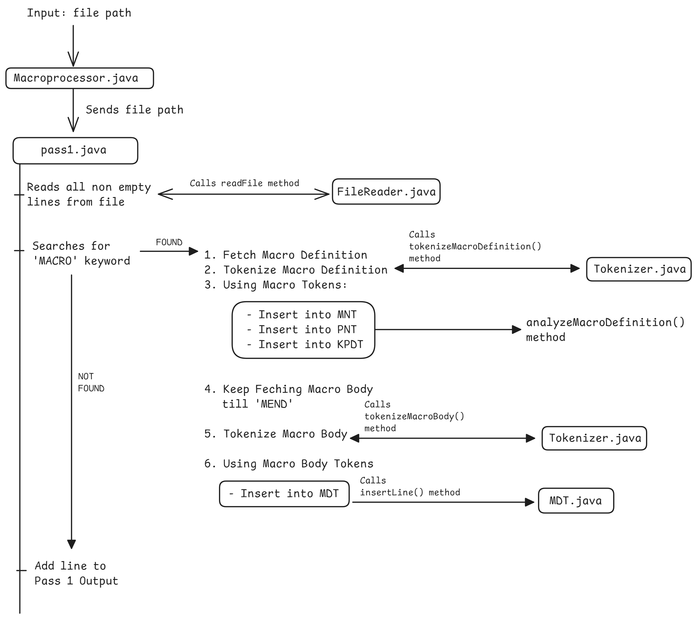

## Assignment 2

### Working Diagram




### Working of Pass 2

Take input from pass1 which will only contain the asm code with macro calls and non-macro calls  
Start reading the input till you get to the macro call  
If line is not a macro call then just copy the line as it is  
  
If line is a macro call, then do further analysis
  
__How would one identify a macro call?__  
Split the line with space as delimiter
Then if the 0th index is inside the MNT, then identify that line as MACRO CALL

__What analysis should i do?__  
Firstly, tokenize the macro call  
0th index -> MACRO NAME  
if the word have '=' symbol -> keyword parameter (increment kp) else positional parameter (increment pp)  
  
At the end, you'll get __MACRO name, pp, kp and totalParameterCount__ and also the __positional parameter list and keyword parameter list__  

Check for MACRO definition having the same name and pp first  
Then check kp  
if current kp > MNT kp, then __wrong MACRO definition__  
if current kp <= MNT kp, then analyze the given keyword parameters  
check if all keyword parameters without default values have been supplied or not. __If not then wrong MACRO definition__  
check if rest of the keyword parameters are there in PNT. __If not then wrong MACRO definition__  

__create APT for the Current Macro Call__

Start reading the MDT using MDTP from MNT and __until you find 'MEND'__  
Tokenize each line  
Check if the word starts and ends with '(' and ')' respectively    
  
Since the start of Parameter Reference is always the same i.e (P,pos)
if n if the length of (P,pos) then get the number from String 3 to n-2 both inclusive  

Search the parameter index in PNT and get back the parameter  
Search the parameter in APT and get back the actual value  
Replace it in the output line  
Do this for Rest of the line  

__Repeat the entire process for next line__


### Folder Structure

```
Assignment      #CWD
|   src
|   |   Macroprocessor.java     #Entry Point
|   |   pass1
|   |   |   ...     # All files
|   target
|   |   Macroprocessor.class
|   |   pass1
|   |   |   ...     # All compiled classes
|   |   
```

## How to run on Linux

```bash
# if target folder not created
mkdir target 

javac -d target $(find src -name "*.java")
java -cp target Macroprocessor

#Java code runs

rm -r target/*
```

## How to run on Windows
```
mkdir target    # if target does not exists

javac -d target (Get-ChildItem -Recurse -Filter *.java -Path src).FullName
java -cp target src.Macroprocessor  <testcase-file.asm>

# Java code runs

rm -r target/*

```


# Test cases

## Testcase 1

```bash
java -cp target src.Macroprocessor  testcase1.asm
```

## Testcase 1 output

```
--- PASS 1 Completed ---
-- Macro Name Table (MNT) --
name    : pp : kp : MDTP : PNTP : KPDTP
M1      : 2  : 2  : 0    : 0    : 0

-- Parameter Name Table (PNT) --
position : parameter
1 : &X
2 : &Y
3 : &A
4 : &B

-- Keyword Parameter Default Table --
parameter  :  default argument
&B :  __
&A : AREG

-- Macro Definition Table --
MOVER (P,3) (P,1)
ADD (P,3) ='1'
MOVER (P,4) (P,2)
ADD (P,3) ='5'
MEND

PASS 1 Output :
M1 10 20 &B=CREG

-- END OF PASS 1 --

--- OUTPUT OF PASS 2 ---
MOVER AREG 10
ADD AREG ='1'
MOVER CREG 20
ADD AREG ='5'

--END OF PASS 2--
```

## Testcase 2

```bash
java -cp target src.Macroprocessor testcase2.asm
```

## Testcase 2 output

```
--- PASS 1 Completed ---
-- Macro Name Table (MNT) --
name    : pp : kp : MDTP : PNTP : KPDTP
M1 : 2 : 2 : 0 : 0 : 0
M2 : 2 : 2 : 5 : 4 : 2


-- Parameter Name Table (PNT) --
position : parameter
1 : &X
2 : &Y
3 : &A
4 : &B
5 : &P
6 : &Q
7 : &U
8 : &V


-- Keyword Parameter Default Table --
parameter  :  default argument
&B :  __
&A : AREG
&V : DREG
&U : CREG


-- Macro Definition Table --
MOVER (P,3) (P,1)
ADD (P,3) ='1'
MOVER (P,4) (P,2)
ADD (P,3) ='5'
MEND
MOVER (P,7) (P,5)
MOVER (P,8) (P,6)
ADD (P,7) ='15'
ADD (P,8) ='10'
MEND


PASS 1 Output :
M1 10 20 &B=CREG
M2 100 200 &V=AREG &U=BREG


-- END OF PASS 1 --

--- OUTPUT OF PASS 2 ---
MOVER AREG 10
ADD AREG ='1'
MOVER CREG 20
ADD AREG ='5'
MOVER BREG 100
MOVER AREG 200
ADD BREG ='15'
ADD AREG ='10'

--END OF PASS 2--
```

## Testcase 3

```bash
java -cp target src.Macroprocessor testcase3.asm
```

## Testcase 3 output

```
--- PASS 1 Completed ---
-- Macro Name Table (MNT) --
name    : pp : kp : MDTP : PNTP : KPDTP
M1      : 2  : 2  : 0    : 0    : 0
M1      : 3  : 2  : 5    : 4    : 2


-- Parameter Name Table (PNT) --
position : parameter
1 : &X
2 : &Y
3 : &B
4 : &A
5 : &P
6 : &Q
7 : &R
8 : &U
9 : &V


-- Keyword Parameter Default Table --
parameter  :  default argument
&B :  __
&A : AREG
&V : DREG
&U : CREG


-- Macro Definition Table --
MOVER (P,4) (P,1)
ADD (P,4) ='1'
MOVER (P,3) (P,2)
ADD (P,4) ='5'
MEND
MOVER (P,8) (P,5)
MOVER (P,9) (P,6)
ADD (P,8) ='15'
ADD (P,9) ='10'
MEND


PASS 1 Output :
M1 10 20 &B=CREG
M1 100 200 300 &V=AREG &U=BREG

-- END OF PASS 1 --

--- OUTPUT OF PASS 2 ---
MOVER AREG 10
ADD AREG ='1'
MOVER CREG 20
ADD AREG ='5'
MOVER BREG 100
MOVER AREG 200
ADD BREG ='15'
ADD AREG ='10'

--END OF PASS 2--
```
