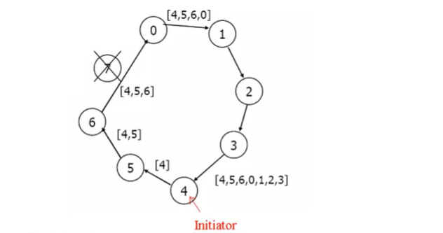

## Leader Election Algorithms

Many distributed algorithms require a process to act as a coordinator.  
The coordinator can be any process that organizes actions of other processes  

The leader/coordinator often assumes responsibilities such as coordination, resource allocation, or decision-making on behalf of the group. Ensures that there is always a designated node responsible for managing tasks or resources, even in dynamic environments where nodes can fail or join.

But the coordinator can fail. Then how is a new coordinator chosen or __elected__?

This is where election algorithms comes in picture

- Ring Election Algorithm
- Bully Election Algorithm

In Election algorithms, there are few assumptions
- Each process has a unique process number or process id to distinguish them
- Process know each other's process number
- All processes in the system are fully connected.
- The process with the highest priority number will be elected as coordinator.


## Bully Algorithm

The Bully Algorithm is a well-known leader election algorithm used in distributed systems that operates on the principle of higher priority.

- __Initiation__: When a node detects that the current leader has failed (usually through a timeout mechanism), it initiates an election.

- __Election Process__: The initiating node sends an “election” message to all other nodes with higher priority.
Nodes with higher priority respond by either acknowledging their current leader status or declaring themselves candidates.
If no higher-priority node responds, the initiating node assumes leadership.

- __Notification__: The newly elected leader informs all nodes of its leadership status, ensuring consistency across the distributed system.

Here is a working diagram of Bully Election Algorithm  


How it works
- When a process P, notices that the coordinator is no longer responding to the request, it initiates an election

- P sends an `Election` message to all the processes with higher priority numbers

- If no one responds, P wins the election and becomes the coordinator

- If one of the higher ups answers, it takes over. P's job is done

- When higher up processes get an `Election` message from one of its lower priority colleagues: Receiver sends an OK message back to the sender to indicate that he is alive and will take over

- Eventually all processes give up apart from one and that one is the new coordinator

- The new coordinator announces it victory by sending all processes a `Coordinator` message telling them that it is the new coordinator

- Now if a process that was previously down comes back, it holds an election

- If it happens to be the highest priority process currently running, it will win the election and take over the coordinator's job

Thus __Biggest guy__ always wins and hence named __Bully Algorithm__
  
  
Input
```
Enter number of processes: 10
Higher the priority number, higher is the priority

Enter priority for process 0: 0
Is process 0 active? (T/F) (Default: T) : 

Enter priority for process 1: 1
Is process 1 active? (T/F) (Default: T) : 

Enter priority for process 2: 2
Is process 2 active? (T/F) (Default: T) : 

Enter priority for process 3: 3
Is process 3 active? (T/F) (Default: T) : 

Enter priority for process 4: 4
Is process 4 active? (T/F) (Default: T) : 

Enter priority for process 5: 5
Is process 5 active? (T/F) (Default: T) :

Enter priority for process 6: 6
Is process 6 active? (T/F) (Default: T) :

Enter priority for process 7: 7
Is process 7 active? (T/F) (Default: T) :

Enter priority for process 8: 8
Is process 8 active? (T/F) (Default: T) :

Enter priority for process 9: 9
Is process 9 active? (T/F) (Default: T) :
```


Output
```
--- BULLY ELECTION ALGORITHM ---
Leader Process: Process 9 with Priority = 9

Leader process failed

Selecting Random Process
Selected Process 4

Starting Simulation with Process 4

Process 4 [Priority 4] sent election message to Process 5 [Priority 5]
Process 4 [Priority 4] sent election message to Process 6 [Priority 6]
Process 4 [Priority 4] sent election message to Process 7 [Priority 7]
Process 4 [Priority 4] sent election message to Process 8 [Priority 8]
Process 4 [Priority 4] sent election message to Process 9 [Priority 9]

Process 7 replied with 'OK'

Received Okay message from one of the higher priority processes
Process 4 Job Done

Restarting algorithm again from Process 7

Starting Simulation with Process 7

Process 7 [Priority 7] sent election message to Process 8 [Priority 8]
Process 7 [Priority 7] sent election message to Process 9 [Priority 9]

Process 8 replied with 'OK'

Received Okay message from one of the higher priority processes
Process 7 Job Done

Restarting algorithm again from Process 8

Starting Simulation with Process 8

Process 8 [Priority 8] sent election message to Process 9 [Priority 9]
Process 9 replied with 'NOT OK'

No OK messages received from higher priority processes

Sending Coordinator message to all lower-priority processes
Process 8 sent Coordinator message to Process 0
Process 8 sent Coordinator message to Process 1
Process 8 sent Coordinator message to Process 2
Process 8 sent Coordinator message to Process 3
Process 8 sent Coordinator message to Process 4
Process 8 sent Coordinator message to Process 5
Process 8 sent Coordinator message to Process 6
Process 8 sent Coordinator message to Process 7

Process 0 replied: New Coordinator Set: Process 8
Process 1 replied: New Coordinator Set: Process 8
Process 2 replied: New Coordinator Set: Process 8
Process 3 replied: New Coordinator Set: Process 8
Process 4 replied: New Coordinator Set: Process 8
Process 5 replied: New Coordinator Set: Process 8
Process 6 replied: New Coordinator Set: Process 8
Process 7 replied: New Coordinator Set: Process 8
--- END ---
```


## Ring Algorithm
The Ring Election Algorithm is a method used in distributed systems to elect a leader among a group of interconnected nodes arranged in a ring-like structure. It ensures that only one node in the network becomes the leader, facilitating coordination and decision-making within the system.

How Does Ring Election Algorithm Work?

Below is how the ring election algorithm works:

- When any process notices that the co-ordinator is not functioning, it builds an ELECTION message containing its own process number and sends the message to its successor. 

- If the successor is down, the sender skips over the successor and goes to the next member
along the ring, or the one after that until a running process is located. At each step, the sender adds its own process number to the list in the message effectively making itself a candidate to be elected as co-ordinator. 

- Eventually, the message gets back to the process that started it all. That process recognizes
this event when it receives an incoming message containing its own process number. 

- At that point, the message type is changed to CO-ORDINATOR and circulated once again, this time to inform everyone else who the co-ordinator is and who the members of the new ring are. When which message has circulated once, it is removed and everyone goes back to
work



- If two processes, say 2 and 5 discover simultaneously that the previous co-ordinator, process 7 has crashed. Each of these builds an ELECTION message and each of them starts circulating its message, independent of the other one.

- Both messages will go all the way around, and both 2 and 5 will convert them into CO-ORDINATOR messages with exactly the same number and in the same order. 

- When both have gone around again, both will be removed. It does not harm to have extra message circulating at worst it consumes a little bandwidth, but this not considered wasteful. 


Input
```
Enter no. of processes: 10
Enter Priority for Process 0 (Default 0) : 
Is Process 0 active? (T/F) (Default T) : 
Enter Priority for Process 1 (Default 1) : 
Is Process 1 active? (T/F) (Default T) : 
Enter Priority for Process 2 (Default 2) : 
Is Process 2 active? (T/F) (Default T) : 
Enter Priority for Process 3 (Default 3) : 
Is Process 3 active? (T/F) (Default T) : 
Enter Priority for Process 4 (Default 4) : 
Is Process 4 active? (T/F) (Default T) : 
Enter Priority for Process 5 (Default 5) : 
Is Process 5 active? (T/F) (Default T) : 
Enter Priority for Process 6 (Default 6) :
Is Process 6 active? (T/F) (Default T) :
Enter Priority for Process 7 (Default 7) :
Is Process 7 active? (T/F) (Default T) :
Enter Priority for Process 8 (Default 8) :
Is Process 8 active? (T/F) (Default T) :
Enter Priority for Process 9 (Default 9) :
Is Process 9 active? (T/F) (Default T) :
```

Output
```
--- RING ELECTION ALGORITHM ---
Leader: Process 9 with Priority 9

Leader Process failed

Selecting Random Process to initiate
Selected Process 7 with Priority 7

Starting simulation with process: 7

Process 7 circulating election message
Sending election message to process 8

Process 8 received election message
Candidate List : [ Process 7 , ]
Sending election message to process 0

Process 0 received election message
Candidate List : [ Process 7 , Process 8 , ]
Sending election message to process 1

Process 1 received election message
Candidate List : [ Process 7 , Process 8 , Process 0 , ]
Sending election message to process 2

Process 2 received election message
Candidate List : [ Process 7 , Process 8 , Process 0 , Process 1 , ]
Sending election message to process 3

Process 3 received election message
Candidate List : [ Process 7 , Process 8 , Process 0 , Process 1 , Process 2 , ]
Sending election message to process 4

Process 4 received election message
Candidate List : [ Process 7 , Process 8 , Process 0 , Process 1 , Process 2 , Process 3 , ]
Sending election message to process 5

Process 5 received election message
Candidate List : [ Process 7 , Process 8 , Process 0 , Process 1 , Process 2 , Process 3 , Process 4 , ]
Sending election message to process 6

Process 6 received election message
Candidate List : [ Process 7 , Process 8 , Process 0 , Process 1 , Process 2 , Process 3 , Process 4 , Process 5 , ]
Sending election message to process 7

Process 7 received back the election message


Process 7 initiating coordinator message circulation
Sending Process 8 coordinator message

Process 8 received coordinator message: Process 8 is new coordinator
Sending Process 0 coordinator message

Process 0 received coordinator message: Process 8 is new coordinator
Sending Process 1 coordinator message

Process 1 received coordinator message: Process 8 is new coordinator
Sending Process 2 coordinator message

Process 2 received coordinator message: Process 8 is new coordinator
Sending Process 3 coordinator message

Process 3 received coordinator message: Process 8 is new coordinator
Sending Process 4 coordinator message

Process 4 received coordinator message: Process 8 is new coordinator
Sending Process 5 coordinator message

Process 5 received coordinator message: Process 8 is new coordinator
Sending Process 6 coordinator message

Process 6 received coordinator message: Process 8 is new coordinator
Sending Process 7 coordinator message

Process 7 received back the coordinator message

Ending Process

```